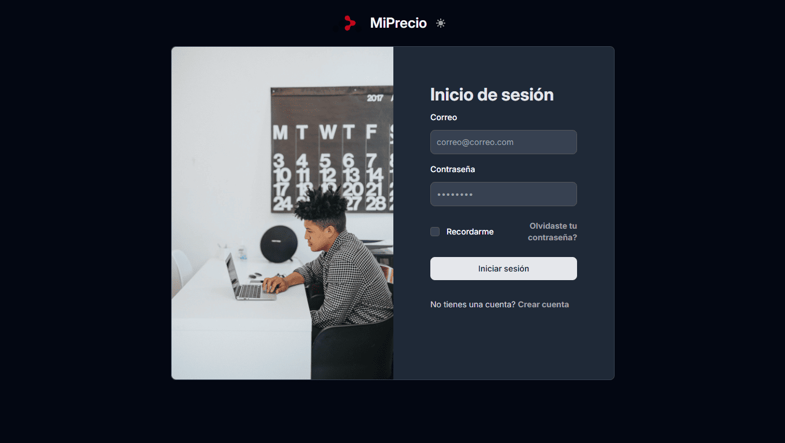
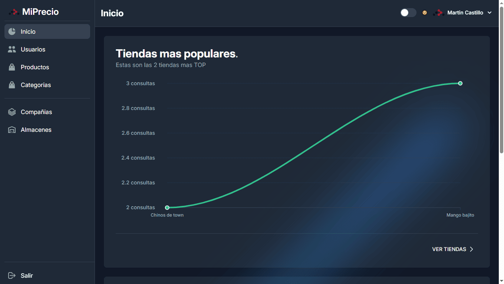
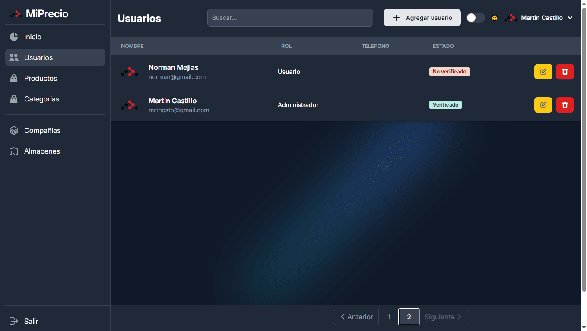
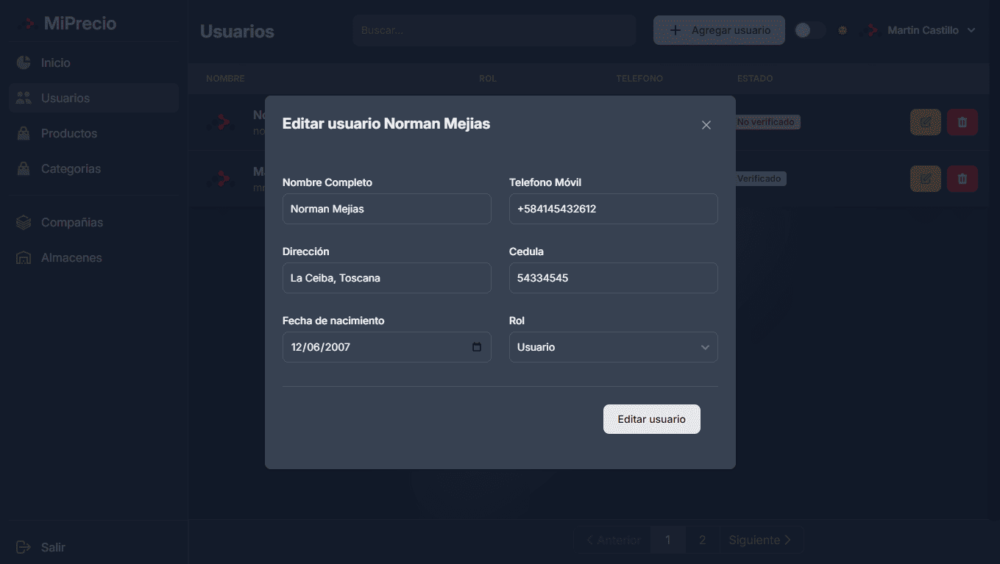
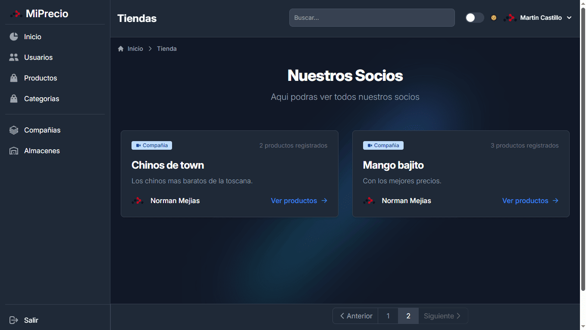
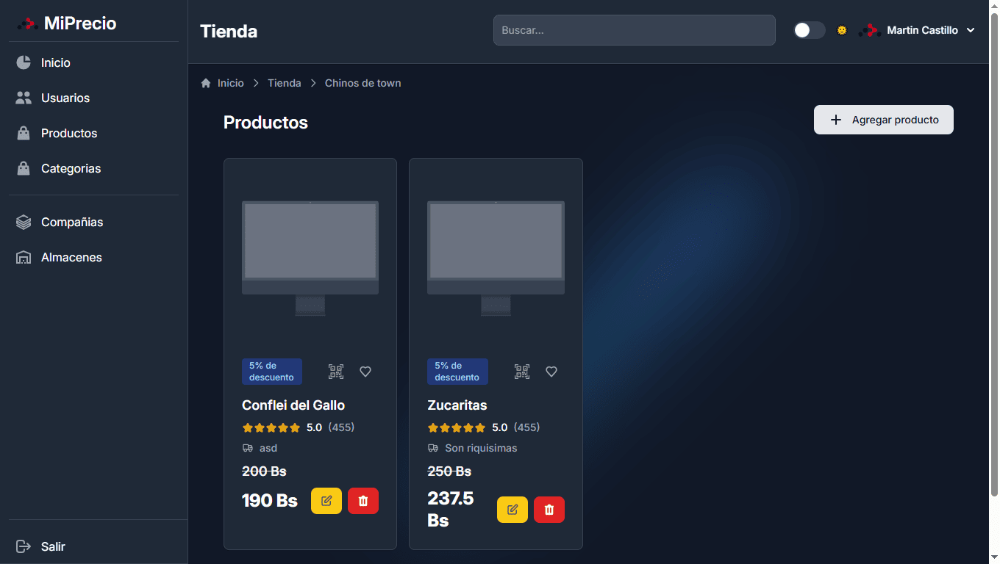
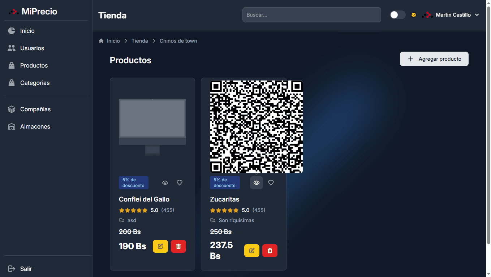
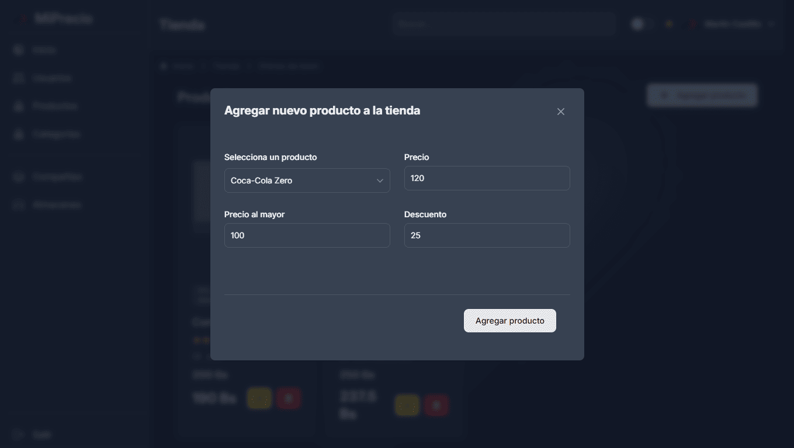

# MiPrecio!

Frotend web para [MiPrecio](https://github.com/waskull/miprecio).

## Tecnologias usadas

- 🚀 React-Router v7 en modo Frameowk
- ⚡️ React-Flowbite + TaildwindCSS
- 📦 Validación de formularios usando Zod + React-Hooks-Forms 
- 🔄 Autenticación usando Cookies
- 🔒 TypeScript

## Screenshots











## Como Iniciar

### Instalación

Instalar dependencias:

```bash
npm install
```

### Desarrollo

Para iniciar el proyecto de modo desarrollo:

```bash
npm run dev
```

Por defecto tu aplicación funcionara en: `http://localhost:5173`.

## Buildear para producción

Crear una build de producción:

```bash
npm run build
```

## Despliegue

### Despligue Docker

Para buildear y desplegar en docker:

```bash
docker build -t my-app .

# Run the container
docker run -p 3000:3000 my-app
```

El container puede ser desplegado en cualquier plataforma que use Docker, incluyendo:

- AWS ECS
- Google Cloud Run
- Azure Container Apps
- Digital Ocean App Platform
- Fly.io
- Railway

Construido con ❤️ usando React Router.
